<div align="center">


<br/>


<br/>


### 🚆 A real RFID tag → Arduino → ESP32-CAM → public Vercel API → Cloudinary + MongoDB → live dashboard

**No localhost in production. No local database. No local image folder. Your laptop can be switched off.**

[🖼️ Screenshots](#-screenshots) •
[🧭 Architecture](#-architecture) •
[⚡ Quick start](#-quick-start-run-it-locally-in-2-minutes) •
[☁️ Deploy](#%EF%B8%8F-deploy-to-the-public-internet) •
[📡 ESP32 API](#-esp32-upload-api) •
[🧪 Test](#-testing--verification) •
[🛟 Troubleshooting](#-troubleshooting)

</div>


<details><summary> <h2><b>Table of contents</b> </h2></summary>

<table>
<tr>
<td valign="top" width="33%">

**Understand**
1. [What is Raksha Rail?](#-what-is-raksha-rail)
2. [Screenshots](#-screenshots)
3. [Architecture](#-architecture)
4. [The journey of one RFID scan](#-the-journey-of-one-rfid-scan)
5. [Project structure](#-project-structure)

</td>
<td valign="top" width="33%">

**Build**
6. [Hardware & firmware](#-hardware--firmware)
7. [Backend API](#%EF%B8%8F-backend-api)
8. [Authentication](#-authentication--sessions)
9. [Live dashboard updates](#-live-dashboard-updates)
10. [Data model](#%EF%B8%8F-data-model)
11. [Threat analysis & AI](#-threat-analysis--future-ai)

</td>
<td valign="top" width="33%">

**Ship**
12. [Environment variables](#-environment-variables)
13. [Quick start (local)](#-quick-start-run-it-locally-in-2-minutes)
14. [Deploy (Atlas, Cloudinary, Vercel)](#%EF%B8%8F-deploy-to-the-public-internet)
15. [Testing & verification](#-testing--verification)
16. [Security](#-security)
17. [Troubleshooting](#-troubleshooting)
18. [Hackathon status](#-hackathon-status)

</td>
</tr>
</table>
</details>


<h2> >>What is Raksha Rail?</h2>

Raksha Rail is a **railway safety monitoring system** built for a hackathon. When a tagged bag or item passes an RFID reader
on a platform, the system automatically photographs it and shows the photo, the RFID UID, the reader, the platform and the
time on a **secure public web dashboard**, anywhere in the world, within seconds.

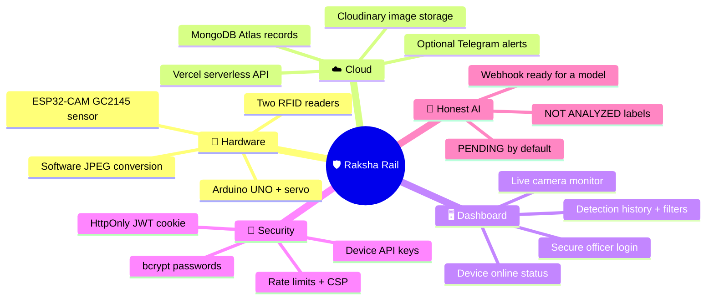

> [!IMPORTANT]
> **No narcotics or explosive AI model is integrated yet.** Receiving an image proves nothing about what is in it, so every
> capture is stored as `threatStatus: PENDING`, `detectionType: UNKNOWN`, `confidence: null` and the dashboard says
> **NOT ANALYZED**. The architecture is ready for a real model. See [Threat analysis & AI](#-threat-analysis--future-ai).


<details><summary><h3><b>SᴄʀᴇᴇɴSʜᴏᴛs</summary>

These are real screenshots of the app running in demo mode (`npm run dev`). The original Raksha Rail design is unchanged. It now shows live cloud data.

<table>
<tr>
<td width="50%" align="center"><b>🔐 Authorized login</b><br/>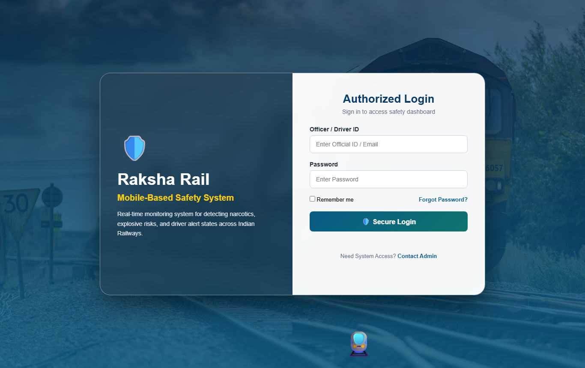</td>
<td width="50%" align="center"><b>📊 Control dashboard (page2)</b><br/>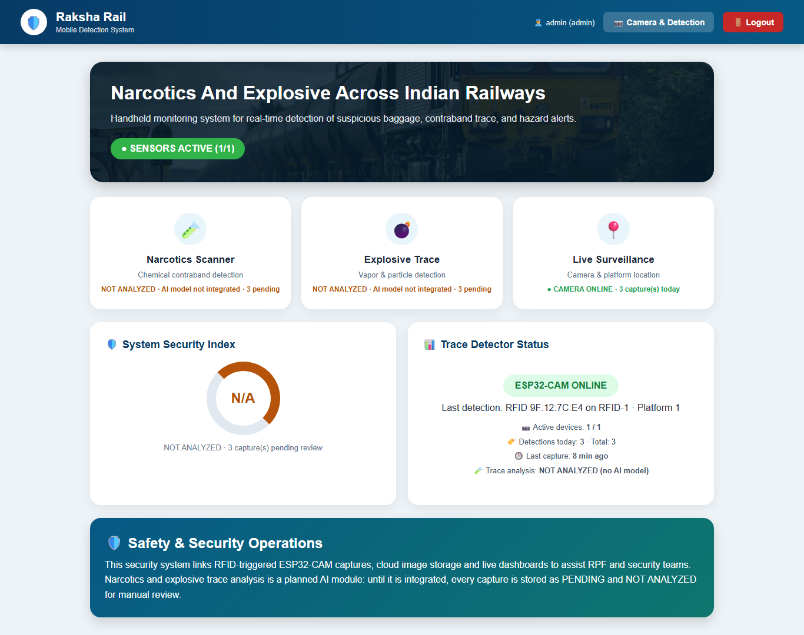</td>
</tr>
<tr>
<td width="50%" align="center"><b>📷 Camera & threat monitor (page3)</b><br/>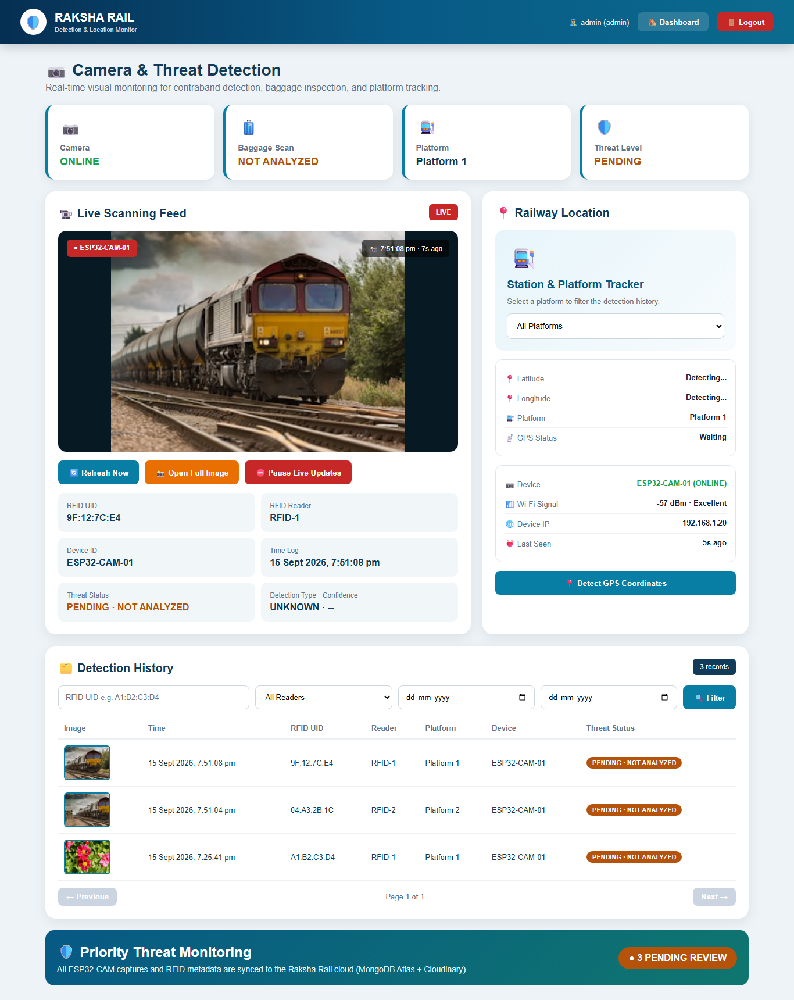</td>
<td width="50%" align="center"><b>📱 Phone view</b><br/>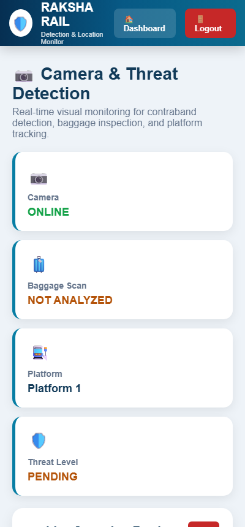</td>
</tr>
</table>


</details>
<h2><b>Architecture</b></h2>

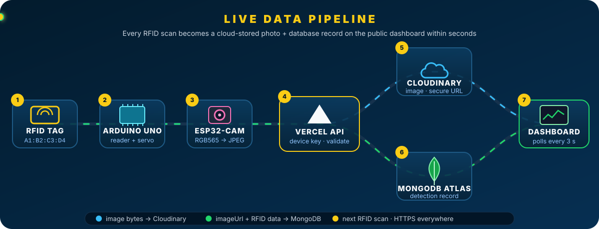

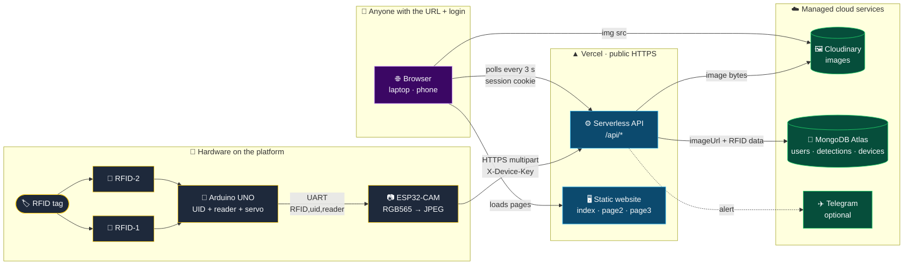
<details><summary><h2>ꜰʟᴏᴡ</h2></summary>
| Layer | Technology | Responsibility |
|---|---|---|
| 🏷️ Sensing | 2× RFID readers + Arduino UNO | Read the tag UID, know which reader saw it, point the camera with a servo |
| 📷 Capture | AI-Thinker ESP32-CAM (GC2145 / RHYX-M21-45) | Capture RGB565, convert to JPEG in software, upload over Wi-Fi + HTTPS |
| ⚙️ API | Vercel serverless functions (Node.js 24) | Authenticate device, validate, store, serve dashboard data |
| 🖼️ Images | Cloudinary | Permanent HTTPS image URLs and thumbnails |
| 🍃 Data | MongoDB Atlas | Users, detections, devices, rate-limit counters |
| 🖥️ UI | Existing HTML/CSS/JS on Vercel | Login, dashboard, live camera monitor, history |
| ✈️ Alerts | Telegram Bot API (optional) | Photo + RFID details sent to a chat |
</details>

> [!NOTE]
> The backend **never talks to the Arduino**. Only the ESP32-CAM calls the API. The browser and the API share the same
> Vercel domain, so no CORS configuration and no hard-coded host are needed.


## 🎬 The journey of one RFID scan

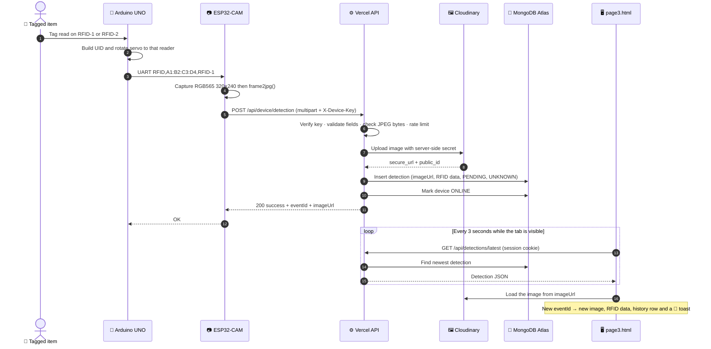


<details><summary><h3>Project structure<h3></h3></summary>

```text
raksha-rail/
├── 🌐 public/                    ← the website (Vercel output directory)
│   ├── index.html                existing login page → /api/auth/login
│   ├── page2.html                existing dashboard → real cloud stats
│   ├── page3.html                existing camera page → latest ESP32 image, RFID data, history
│   └── js/raksha-api.js          shared fetch · session · polling helpers (same-origin)
├── ⚙️ api/                       ← Vercel serverless functions (10 functions)
│   ├── health.js                 GET  /api/health
│   ├── auth/login.js             POST /api/auth/login
│   ├── auth/logout.js            POST /api/auth/logout
│   ├── auth/me.js                GET  /api/auth/me
│   ├── device/detection.js       POST /api/device/detection   ← ESP32 upload
│   ├── device/heartbeat.js       POST /api/device/heartbeat   ← ESP32 status
│   ├── detections/index.js       GET  /api/detections         ← history
│   ├── detections/latest.js      GET  /api/detections/latest
│   ├── detections/[id].js        GET/PATCH /api/detections/:id
│   └── dashboard/stats.js        GET  /api/dashboard/stats
├── 🧩 lib/                       ← server-only code (never served to browsers)
│   ├── mongodb.js                cached Atlas connection + indexes
│   ├── cloudinary.js             server-side image upload
│   ├── auth.js                   bcrypt · JWT cookie · device keys
│   ├── validation.js             input + image validation
│   ├── rateLimit.js              MongoDB-backed rate limiting
│   ├── records.js                serializers · device online status
│   ├── analysis.js               PENDING defaults + AI webhook hook
│   ├── telegram.js               optional Telegram alerts
│   └── time.js                   "today" in APP_TIMEZONE
├── 🛠️ scripts/
│   ├── dev-server.mjs            npm run dev   → local server (demo or cloud mode)
│   ├── create-user.mjs           npm run create-user
│   └── test-upload.mjs           npm run test-upload → simulate the ESP32
├── 🔌 firmware/
│   ├── esp32cam_raksha/          ESP32-CAM sketch + secrets.example.h
│   └── arduino_uno_rfid/         Arduino UNO sketch (2× MFRC522 + servo)
├── 🎨 docs/                      README graphics and screenshots
├── package.json · vercel.json · .env.example · .gitignore
```
</details>

<h3> What changed in the original pages</h3>


| ᴘᴀɢᴇ |   ʙᴇꜰᴏʀᴇ |   ɴᴏᴡ |
|---|---|---|
| ɪɴᴅᴇx.ʜᴛᴍʟ | ᴀɴʏ ɪɴᴘᴜᴛ "ʟᴏɢɢᴇᴅ ɪɴ" | ʀᴇᴀʟ ʟᴏɢɪɴ, ɪɴʟɪɴᴇ ᴇʀʀᴏʀ ᴍᴇꜱꜱᴀɢᴇ, ʀᴇᴍᴇᴍʙᴇʀ ᴍᴇ ᴋᴇᴇᴘꜱ ʏᴏᴜ ꜱɪɢɴᴇᴅ ɪɴ ꜰᴏʀ 𝟽 ᴅᴀʏꜱ, ᴀᴜᴛᴏ-ʀᴇᴅɪʀᴇᴄᴛ ɪꜰ ᴀʟʀᴇᴀᴅʏ ꜱɪɢɴᴇᴅ ɪɴ |
| ᴘᴀɢᴇ𝟸.ʜᴛᴍʟ | ʜᴀʀᴅ-ᴄᴏᴅᴇᴅ 𝟿𝟾% ᴄʟᴇᴀʀ, ᴠᴀᴘᴏʀ ꜱᴇɴꜱᴏʀꜱ ᴏɴʟɪɴᴇ | ʀᴇᴀʟ ᴅᴇᴠɪᴄᴇ ꜱᴛᴀᴛᴜꜱ ᴀɴᴅ ᴄᴏᴜɴᴛꜱ. ᴛʜᴇ ꜱᴇᴄᴜʀɪᴛʏ ɪɴᴅᴇx ɪꜱ ɴ/ᴀ ᴜɴᴛɪʟ ᴄᴀᴘᴛᴜʀᴇꜱ ᴀʀᴇ ᴀɴᴀʟʏᴢᴇᴅ, ᴀɴᴅ ᴛʜᴇ ɴᴀʀᴄᴏᴛɪᴄꜱ/ᴇxᴘʟᴏꜱɪᴠᴇ ᴄᴀʀᴅꜱ ꜱᴀʏ ɴᴏᴛ ᴀɴᴀʟʏᴢᴇᴅ |
| ᴘᴀɢᴇ𝟹.ʜᴛᴍʟ | ʙʀᴏᴡꜱᴇʀ ᴡᴇʙᴄᴀᴍ + ꜰᴀᴋᴇ "ᴜɴᴀᴛᴛᴇɴᴅᴇᴅ ʙᴀɢ 𝟿𝟺%" | ʟᴀᴛᴇꜱᴛ ᴇꜱᴘ𝟹𝟸-ᴄᴀᴍ ɪᴍᴀɢᴇ ꜰʀᴏᴍ ᴄʟᴏᴜᴅɪɴᴀʀʏ, ʀꜰɪᴅ ᴜɪᴅ, ʀᴇᴀᴅᴇʀ, ᴘʟᴀᴛꜰᴏʀᴍ, ᴅᴇᴠɪᴄᴇ, ᴛɪᴍᴇꜱᴛᴀᴍᴘ, ᴛʜʀᴇᴀᴛ ꜱᴛᴀᴛᴜꜱ, ᴄᴀᴍᴇʀᴀ ᴏɴʟɪɴᴇ/ᴏꜰꜰʟɪɴᴇ, ᴡɪ-ꜰɪ ꜱɪɢɴᴀʟ, ꜰɪʟᴛᴇʀᴀʙʟᴇ ᴘᴀɢɪɴᴀᴛᴇᴅ ʜɪꜱᴛᴏʀʏ, ᴀᴜᴛᴏ-ᴜᴘᴅᴀᴛᴇꜱ ᴇᴠᴇʀʏ 𝟹 ꜱ |
| ʟᴏɢᴏᴜᴛ | ʟɪɴᴋᴇᴅ ᴛᴏ ᴀ ᴍɪꜱꜱɪɴɢ ʟᴏɢɪɴꜰᴏʀᴍ.ʜᴛᴍʟ | ᴄʟᴇᴀʀꜱ ᴛʜᴇ ꜱᴇᴄᴜʀᴇ ꜱᴇꜱꜱɪᴏɴ ᴀɴᴅ ʀᴇᴛᴜʀɴꜱ ᴛᴏ ᴛʜᴇ ʟᴏɢɪɴ ᴘᴀɢᴇ |


<h3> Hardware & firmware</h3>

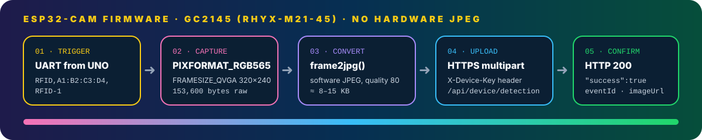

<h3>Arduino UNO logic</h3>

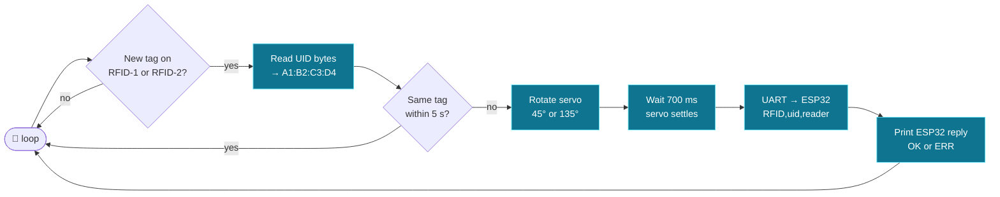


<details><summary><h3>ESP32-CAM firmware logic</h3></summary>
 
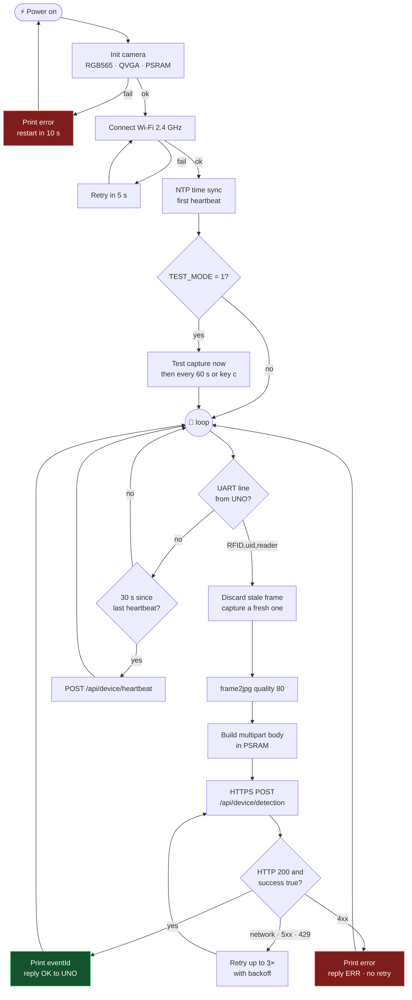
</details>
 
> [!WARNING]
> The camera module is marked **RHYX-M21-45** and behaves like a **GC2145**. It is **not an OV2640** and has **no hardware
> JPEG**. `PIXFORMAT_JPEG` does not work. The firmware captures `PIXFORMAT_RGB565` at `FRAMESIZE_QVGA` and converts it with
> `frame2jpg()` in software.
 
<details><summary><h3>Flash the ESP32-CAM</h3></summary>
 
1. **Arduino IDE → Boards Manager →** install **esp32 by Espressif Systems** (2.0.14+ or 3.x).
2. Open [`firmware/esp32cam_raksha/esp32cam_raksha.ino`](firmware/esp32cam_raksha/esp32cam_raksha.ino).
3. Copy `secrets.example.h` → **`secrets.h`** (git-ignored) and fill in:
```cpp
   #define WIFI_SSID        "your-wifi-name"          // 2.4 GHz network
   #define WIFI_PASSWORD    "your-wifi-password"
   #define API_HOST         "raksha-rail.vercel.app"  // no https://, no trailing slash
   #define DEVICE_API_KEY   "same value as DEVICE_API_KEY in Vercel"
   #define DEVICE_ID        "ESP32-CAM-01"
   #define PLATFORM_NAME    "Platform 1"
```
 
4. **Tools:** Board **AI Thinker ESP32-CAM** · PSRAM **Enabled** · Partition **Huge APP (3MB No OTA)**.
5. Connect **GPIO0 → GND**, press reset, upload. Remove the jumper and press reset again.
6. Open the **Serial Monitor at 115200 baud**. Power the board from a solid **5 V / 2 A** supply.
</details>

<details>
<summary><b>📟 Expected Serial Monitor output (click to expand)</b></summary>
```text
=== Raksha Rail ESP32-CAM ===
Camera sensor PID: 0x2145 (GC2145)
Camera ready (RGB565, QVGA)
WiFi connecting...
WiFi connected
IP address: 192.168.1.20
Signal: -58 dBm
Heartbeat -> HTTP 200
TEST_MODE: uploading a test capture now (type 'c' to capture again)
Capturing image...
Frame: 320x240, 153600 bytes, format 0
Converting RGB565 to JPEG...
JPEG size: 9412 bytes
Uploading... (attempt 1/3, 10133 bytes to https://raksha-rail.vercel.app/api/device/detection)
HTTP response: 200
{"success":true,"eventId":"66e2b1f4...","imageUrl":"https://res.cloudinary.com/...","threatStatus":"PENDING",...}
Upload successful
Image URL: https://res.cloudinary.com/...
Event ID: 66e2b1f4...
```
 
</details>
### 🎛️ Firmware options
 
| `#define` | Default | Use it when |
|---|---|---|
| `TEST_MODE` | `1` | `1` = test uploads without Arduino (boot, every 60 s, key `c`). `0` = RFID-triggered only |
| `JPEG_QUALITY` | `80` | Smaller files → lower value |
| `SWAP_RGB565_BYTES` | `0` | Colors look wrong or psychedelic → `1` |
| `FLIP_VERTICAL` / `MIRROR_HORIZONTAL` | `0` | Image upside down or mirrored |
| `XCLK_FREQ_HZ` | `20000000` | Garbled frames → `10000000` |
| `USE_FLASH_LED` | `0` | Dark scene → `1` (GPIO4 flash) |
| `HEARTBEAT_INTERVAL_MS` | `30000` | How often the device reports ONLINE |
| `UPLOAD_ATTEMPTS` | `3` | Retries for network / 5xx / 429 errors |
 
### 🔗 Wiring the Arduino UNO to the ESP32-CAM
 
The reference sketch is [`firmware/arduino_uno_rfid/arduino_uno_rfid.ino`](firmware/arduino_uno_rfid/arduino_uno_rfid.ino) (libraries: **MFRC522**, **Servo**, **SoftwareSerial**).
 
| From | To | Notes |
|---|---|---|
| UNO **D3** (TX) | 1 kΩ → ESP32 **GPIO13** | plus **2 kΩ from GPIO13 to GND** (5 V → 3.3 V divider) |
| ESP32 **GPIO14** | UNO **D2** (RX) | ESP32 replies `OK` / `ERR,UPLOAD` |
| UNO **GND** | ESP32 **GND** | common ground is required |
| MFRC522 #1 / #2 | SCK 13 · MISO 12 · MOSI 11 · RST 9 · SS **10** / **8** | readers on **3.3 V** |
| Servo signal | UNO **D6** | power the servo from a separate 5 V supply |
 
Serial protocol, 9600 baud, one line per scan:
 
```text
RFID,A1:B2:C3:D4,RFID-1
```
 
> [!TIP]
> **Flashing order:** first get `TEST_MODE 1` uploads working (proves Wi-Fi, HTTPS, camera, JPEG, cloud). Only then set
> `TEST_MODE 0` and connect the Arduino.
 
> [!CAUTION]
> By default the ESP32 uses `setInsecure()`: traffic is **encrypted**, but the server certificate is **not verified**. For
> stronger security, paste your Vercel domain's root CA certificate into `ROOT_CA_PEM` in `secrets.h`. Find it in the
> browser padlock → certificate → top of the chain → export as PEM.
 

## ⚙️ Backend API
 
<p align="center">─────────────────<br/>「 ʙᴀᴄᴋᴇɴᴅ API 」<br/>─────────────────</p>
All responses are JSON. Errors always look like `{ "success": false, "error": "message" }`.
 
| Method | Path | Who can call | Purpose |
|---|---|---|---|
| `POST` | `/api/device/detection` | 📷 `X-Device-Key` | ESP32 image + RFID upload |
| `POST` | `/api/device/heartbeat` | 📷 `X-Device-Key` | ESP32 online status |
| `POST` | `/api/auth/login` | 🌍 public | Website login → session cookie |
| `POST` | `/api/auth/logout` | 🌍 public | Clear session cookie |
| `GET` | `/api/auth/me` | 👮 session | Current user |
| `GET` | `/api/detections/latest` | 👮 session | Newest detection (`null` if none) |
| `GET` | `/api/detections` | 👮 session | Paginated, filtered history |
| `GET` | `/api/detections/:id` | 👮 session | One detection |
| `PATCH` | `/api/detections/:id` | 👮 admin/officer or 🤖 `X-Analysis-Key` | Record review / AI result |
| `GET` | `/api/dashboard/stats` | 👮 session | Real counts + device status |
| `GET` | `/api/health` | 🌍 public | Deployment check (never shows secret values) |
 
### 📡 ESP32 upload API
 
<table>
<tr><td><b>Endpoint</b></td><td><code>POST https://&lt;your-app&gt;.vercel.app/api/device/detection</code></td></tr>
<tr><td><b>Headers</b></td><td><code>X-Device-Key: &lt;DEVICE_API_KEY&gt;</code><br/><code>Content-Type: multipart/form-data; boundary=...</code></td></tr>
<tr><td><b>Body</b></td><td><code>image</code> · <code>rfidUid</code> · <code>readerId</code> · <code>deviceId</code> · <code>platform</code> · optional <code>timestamp</code>, <code>wifiSignal</code></td></tr>
</table>
| Field | Required | Validation | Example |
|---|:---:|---|---|
| `image` | ✅ | File, **JPEG or PNG** checked by magic bytes, **128 B – 3 MB** | `captured.jpg` |
| `rfidUid` | ✅ | 4–10 hex bytes; `:` `-` spaces optional; stored as `A1:B2:C3:D4` | `A1:B2:C3:D4` |
| `readerId` | ✅ | Letters, digits, `_ . -`, max 32 | `RFID-1` |
| `deviceId` | ✅ | Letters, digits, `_ . -`, max 64 | `ESP32-CAM-01` |
| `platform` | ✅ | Letters, digits, spaces, `_ . -`, max 40 | `Platform 1` |
| `timestamp` | – | ISO-8601 with `Z`/offset or epoch s/ms. If it isn't within the last 24 h, server time is used | `2026-09-12T10:15:30Z` |
| `wifiSignal` | – | Integer dBm, −127…0 | `-62` |
 
<details>
<summary><b>🧾 Raw multipart request, exactly what the firmware sends (click to expand)</b></summary>
```http
POST /api/device/detection HTTP/1.1
Host: raksha-rail.vercel.app
X-Device-Key: <DEVICE_API_KEY>
Content-Type: multipart/form-data; boundary=----RakshaRail1a2b3c
 
------RakshaRail1a2b3c
Content-Disposition: form-data; name="rfidUid"
 
A1:B2:C3:D4
------RakshaRail1a2b3c
Content-Disposition: form-data; name="readerId"
 
RFID-1
------RakshaRail1a2b3c
Content-Disposition: form-data; name="deviceId"
 
ESP32-CAM-01
------RakshaRail1a2b3c
Content-Disposition: form-data; name="platform"
 
Platform 1
------RakshaRail1a2b3c
Content-Disposition: form-data; name="wifiSignal"
 
-62
------RakshaRail1a2b3c
Content-Disposition: form-data; name="image"; filename="captured.jpg"
Content-Type: image/jpeg
 
<JPEG bytes>
------RakshaRail1a2b3c--
```
 
</details>
**✅ Success — `200`**
 
```json
{
  "success": true,
  "eventId": "66e2b1f4c9a1d2e3f4a5b6c7",
  "imageUrl": "https://res.cloudinary.com/<cloud>/image/upload/v1726136130/raksha-rail/detections/2026-09-12T10-15-30-000Z_1a2b3c4d.jpg",
  "threatStatus": "PENDING",
  "detectionType": "UNKNOWN",
  "timestamp": "2026-09-12T10:15:30.000Z",
  "message": "Detection recorded successfully"
}
```
 
### 🔍 How the server processes an upload
 
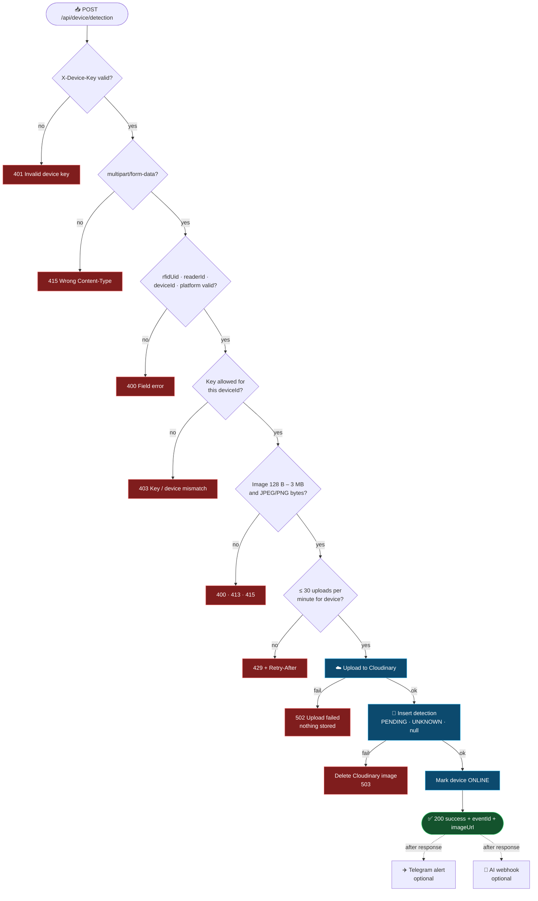
 
| Status | Meaning | What to do |
|:---:|---|---|
| `400` | A field or the image is missing/invalid | Read `error`, e.g. `"rfidUid" is invalid (expected 4-10 hex bytes...)` |
| `401` | Missing or wrong `X-Device-Key` | Key must match Vercel exactly. Redeploy after changing it |
| `403` | Key not allowed for this `deviceId` | Check `DEVICE_KEYS` bindings |
| `413` | Image larger than 3 MB | Lower resolution or `JPEG_QUALITY` |
| `415` | Not multipart, or not JPEG/PNG | Check `Content-Type` and conversion |
| `422` | Cloudinary rejected the image | Image data is corrupt |
| `429` | More than 30 uploads per minute | Wait `Retry-After` seconds |
| `502` | Cloudinary unreachable / credentials wrong | Check `CLOUDINARY_*` variables |
| `503` | Database unreachable | Check `MONGODB_URI` and Atlas network access |
 
### 💓 Heartbeat
 
```http
POST https://<your-app>.vercel.app/api/device/heartbeat
X-Device-Key: <DEVICE_API_KEY>
Content-Type: application/json
 
{ "deviceId": "ESP32-CAM-01", "wifiSignal": -62, "ipAddress": "192.168.1.20" }
```
 
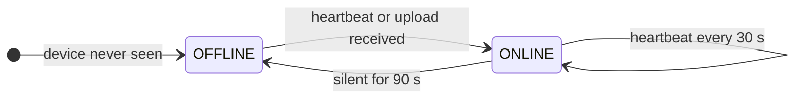
 
A device is **ONLINE** if anything arrived within `DEVICE_OFFLINE_AFTER_SECONDS` (default **90 s**).
 
### 🗂️ History & stats queries
 
```http
GET /api/detections?page=1&limit=20&readerId=RFID-1&rfidUid=A1:B2:C3:D4&platform=Platform%201&deviceId=ESP32-CAM-01&threatStatus=PENDING&fromDate=2026-09-01&toDate=2026-09-12
```
 
| Parameter | Rule |
|---|---|
| `page` | ≥ 1 (default 1) |
| `limit` | 1–100 (default 20) |
| `readerId` · `rfidUid` · `platform` · `deviceId` | Exact match (RFID UID is normalized) |
| `threatStatus` | `PENDING` · `CLEAR` · `SUSPICIOUS` · `THREAT` |
| `fromDate` · `toDate` | `YYYY-MM-DD` (a whole day in `APP_TIMEZONE`) or a full ISO timestamp |
 
The response is `{ page, limit, total, totalPages, items: [...] }`.
 
`GET /api/dashboard/stats` returns real values only, and zeros when nothing exists:
 
```json
{
  "totalDetections": 25,
  "detectionsToday": 5,
  "latestDetection": { "id": "...", "rfidUid": "A1:B2:C3:D4", "imageUrl": "https://..." },
  "cameraStatus": "ONLINE",
  "activeDevices": 1,
  "pendingThreats": 5,
  "totalDevices": 1,
  "devices": [{ "deviceId": "ESP32-CAM-01", "status": "ONLINE", "wifiSignal": -62, "lastSeen": "..." }],
  "threatSummary": { "PENDING": 5, "CLEAR": 0, "SUSPICIOUS": 0, "THREAT": 0, "analyzed": 0 },
  "securityIndex": null,
  "aiAnalysis": "NOT_INTEGRATED"
}
```
 

## 🔐 Authentication & sessions
 
<p align="center">───────────────────────────────<br/>「 ᴀᴜᴛʜᴇɴᴛɪᴄᴀᴛɪᴏɴ & sᴇssɪᴏɴs 」<br/>───────────────────────────────</p>
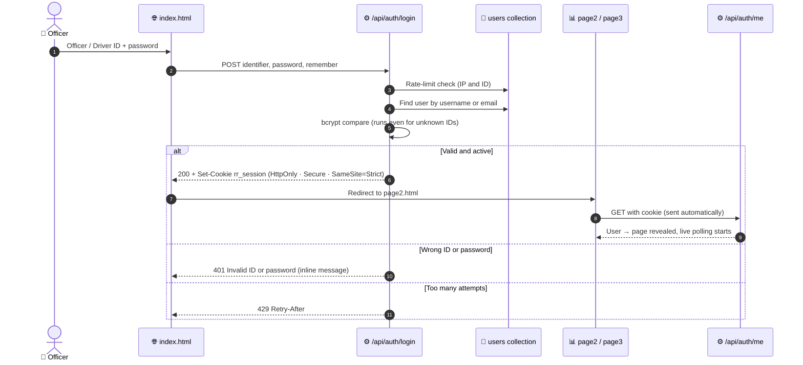
 
| Role | View dashboard & camera | Record review (`PATCH`) | Typical user |
|---|:---:|:---:|---|
| `admin` | ✅ | ✅ | Project lead |
| `officer` | ✅ | ✅ | RPF / security officer |
| `operator` | ✅ | ❌ | Control-room viewer |
 
| Page | Access |
|---|---|
| `index.html` (login) | 🌍 Public |
| `page2.html` (dashboard) | 🔒 Login required |
| `page3.html` (camera monitor) | 🔒 Login required |
| `/api/device/*` | 🔑 Device key required |
 
**Session rules:** the JWT lasts 12 h by default (`SESSION_HOURS`). Ticking **Remember me** keeps you signed in for 7 days. Login is limited to 10
attempts per ID and 30 per IP address in 15 minutes.
 

## 📺 Live dashboard updates
 
<p align="center">────────────────────────────<br/>「 ʟɪᴠᴇ ᴅᴀsʜʙᴏᴀʀᴅ ᴜᴘᴅᴀᴛᴇs 」<br/>────────────────────────────</p>
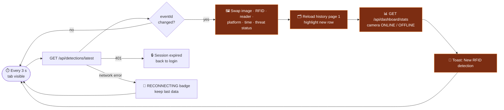
 
- **page3.html** polls `/api/detections/latest` every **3 s** and `/api/dashboard/stats` every **10 s**.
- **page2.html** polls `/api/dashboard/stats` every **5 s**.
- Polling **pauses automatically** when the tab is hidden, and page3 has a **⛔ Pause Live Updates** button.
- WebSockets aren't needed: polling is simpler and very reliable for a hackathon demo.

## 🗃️ Data model
 
<p align="center">────────────────<br/>「 ᴅᴀᴛᴀ ᴍᴏᴅᴇʟ 」<br/>────────────────</p>
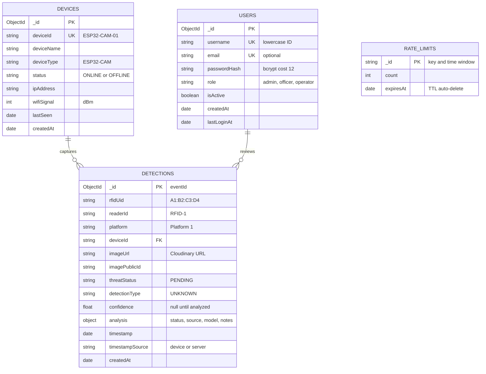
 
> [!NOTE]
> **Images are never stored in MongoDB**, only `imageUrl` and `imagePublicId`. The bytes live in Cloudinary. Indexes
> (unique usernames/device IDs, time-sorted detections, TTL for rate limits) are created automatically on first connection.
 
<details>
<summary><b>📄 Example detection document (click to expand)</b></summary>
```json
{
  "_id": "66e2b1f4c9a1d2e3f4a5b6c7",
  "rfidUid": "A1:B2:C3:D4",
  "readerId": "RFID-1",
  "platform": "Platform 1",
  "deviceId": "ESP32-CAM-01",
  "imageUrl": "https://res.cloudinary.com/<cloud>/image/upload/v1726136130/raksha-rail/detections/....jpg",
  "imagePublicId": "raksha-rail/detections/2026-09-12T10-15-30-000Z_1a2b3c4d",
  "image": { "width": 320, "height": 240, "bytes": 9412, "format": "jpg" },
  "threatStatus": "PENDING",
  "detectionType": "UNKNOWN",
  "confidence": null,
  "analysis": { "status": "NOT_ANALYZED", "source": null, "model": null, "notes": null, "analyzedAt": null, "reviewedBy": null },
  "timestamp": "2026-09-12T10:15:30.000Z",
  "timestampSource": "device",
  "createdAt": "2026-09-12T10:15:31.204Z"
}
```
 
</details>

## 🤖 Threat analysis & future AI
 
<p align="center">─────────────────────────────────<br/>「 ᴛʜʀᴇᴀᴛ ᴀɴᴀʟʏsɪs & ғᴜᴛᴜʀᴇ AI 」<br/>─────────────────────────────────</p>
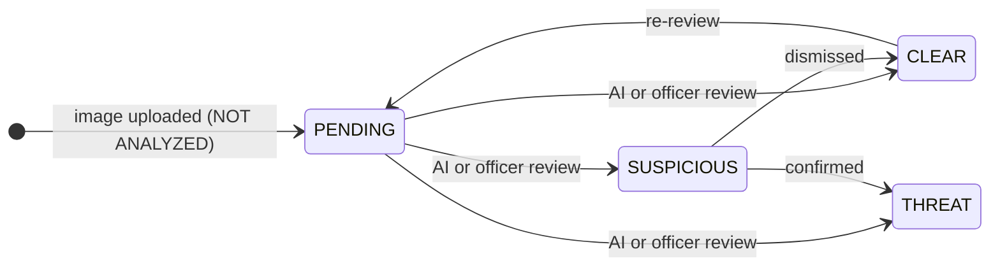
 
| `threatStatus` | Dashboard shows | Set by |
|---|---|---|
| `PENDING` | 🟠 **PENDING · NOT ANALYZED** | Automatically on every upload |
| `CLEAR` | 🟢 LOW / SAFE | AI service or admin/officer |
| `SUSPICIOUS` | 🟠 ELEVATED + frame highlight | AI service or admin/officer |
| `THREAT` | 🔴 HIGH + frame highlight | AI service or admin/officer |
 
`detectionType`: `UNKNOWN` · `NONE` · `NARCOTICS` · `EXPLOSIVE` · `WEAPON` · `OTHER` · `confidence`: `0.0–1.0` or `null`
 
### 🔌 Plugging in an AI model later
 
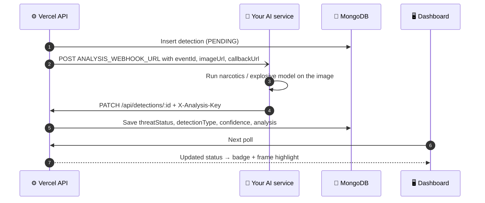
 
1. Set `ANALYSIS_WEBHOOK_URL` and `ANALYSIS_API_KEY` in Vercel and redeploy.
2. Every new detection is POSTed to your service:
   `{ eventId, imageUrl, rfidUid, readerId, platform, deviceId, timestamp, callbackUrl }` with header `X-Analysis-Key`.
3. Your service reports the result:
```http
   PATCH https://<your-app>.vercel.app/api/detections/<eventId>
   X-Analysis-Key: <ANALYSIS_API_KEY>
   Content-Type: application/json
 
   { "threatStatus": "CLEAR", "detectionType": "NONE", "confidence": 0.93, "model": "yolo-custom-v1" }
```
 
4. The dashboard shows the result on its next poll. Officers can record a manual review with the same `PATCH` while logged in.

## 🔧 Environment variables
 
<p align="center">───────────────────────────<br/>「 ᴇɴᴠɪʀᴏɴᴍᴇɴᴛ ᴠᴀʀɪᴀʙʟᴇs 」<br/>───────────────────────────</p>
Set these in **Vercel → Project → Settings → Environment Variables**. For local runs, put them in `.env`
(git-ignored). [`.env.example`](.env.example) lists every variable with placeholders.
 
> [!IMPORTANT]
> **After changing any environment variable in Vercel, redeploy.** Running deployments don't pick up new values.
 
| Variable | Required | Description |
|---|:---:|---|
| `MONGODB_URI` | ✅ | Atlas `mongodb+srv://...` connection string |
| `MONGODB_DB` | – | Database name (default `raksha_rail`) |
| `CLOUDINARY_CLOUD_NAME` | ✅ | Cloudinary cloud name |
| `CLOUDINARY_API_KEY` | ✅ | Cloudinary API key |
| `CLOUDINARY_API_SECRET` | ✅ | Cloudinary API secret. **Server-side only** |
| `CLOUDINARY_FOLDER` | – | Default `raksha-rail/detections` |
| `JWT_SECRET` | ✅ | At least 32 random characters |
| `SESSION_HOURS` | – | Login session length (default `12`) |
| `DEVICE_API_KEY` | ✅ | At least 16 chars (use 32+ random). Same value goes in the firmware |
| `DEVICE_KEYS` | – | Per-device keys: `ESP32-CAM-01:key1,ESP32-CAM-02:key2` |
| `DEVICE_OFFLINE_AFTER_SECONDS` | – | Default `90` |
| `BOOTSTRAP_ADMIN_USERNAME` | 1st deploy | First admin, created while `users` is empty |
| `BOOTSTRAP_ADMIN_PASSWORD` | 1st deploy | At least 10 chars. **Delete after first login** |
| `BOOTSTRAP_ADMIN_EMAIL` | – | Optional admin email |
| `APP_TIMEZONE` | – | For "detections today" (default `Asia/Kolkata`) |
| `TELEGRAM_BOT_TOKEN` · `TELEGRAM_CHAT_ID` | – | Optional Telegram alerts |
| `ANALYSIS_WEBHOOK_URL` · `ANALYSIS_API_KEY` | – | Optional future AI service |
 
🎲 **Generate strong secrets** (run once for `JWT_SECRET`, once for `DEVICE_API_KEY`):
 
```bash
node -e "console.log(require('crypto').randomBytes(32).toString('hex'))"
```
 

## ⚡ Quick start: run it locally in 2 minutes
 
<p align="center">────────────────────────────<br/>「 ǫᴜɪᴄᴋ sᴛᴀʀᴛ: ʟᴏᴄᴀʟ ʀᴜɴ 」<br/>────────────────────────────</p>
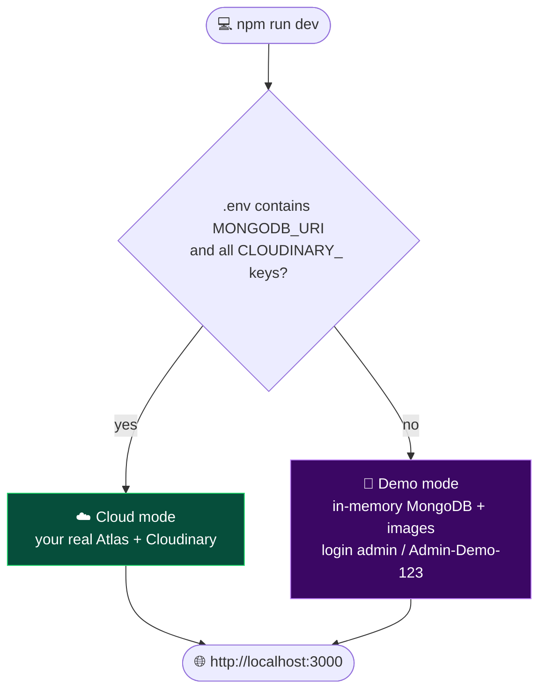
 
**Requirements:** [Node.js 24](https://nodejs.org) and Git.
 
```bash
git clone https://github.com/<you>/raksha-rail.git
cd raksha-rail
npm install
npm run dev
```
 
Open **http://localhost:3000** and log in:
 
| Mode | Login | Device key |
|---|---|---|
| 🧪 Demo (no `.env`) | `admin` / `Admin-Demo-123` | `local-demo-device-key` |
| ☁️ Cloud (`.env` filled) | your `BOOTSTRAP_ADMIN_*` user | your `DEVICE_API_KEY` |
 
📸 **Watch a live update:** keep `page3.html` open and, in a second terminal, run:
 
```bash
npm run test-upload -- --url http://localhost:3000 --key local-demo-device-key --rfid 04:A3:2B:1C --reader RFID-2
```
 
> [!NOTE]
> - Demo mode keeps data **in memory** and loses it when you stop the server. The first run downloads a MongoDB binary (~780 MB, cached afterwards).
> - `npm run dev` is **only for development**. The ESP32 and the public use the Vercel deployment, never localhost.
 

## ☁️ Deploy to the public internet
 
<p align="center">───────────────────────────────────<br/>「 ᴅᴇᴘʟᴏʏ ᴛᴏ ᴛʜᴇ ᴘᴜʙʟɪᴄ ɪɴᴛᴇʀɴᴇᴛ 」<br/>───────────────────────────────────</p>
```mermaid
flowchart LR
  A["1️⃣ GitHub<br/>repository"] --> B["2️⃣ MongoDB Atlas<br/>cluster + user"]
  B --> C["3️⃣ Cloudinary<br/>API keys"]
  C --> D["4️⃣ Vercel<br/>import + env vars"]
  D --> E["5️⃣ Deploy<br/>/api/health ok"]
  E --> F["6️⃣ Login<br/>bootstrap admin"]
  F --> G["7️⃣ test-upload<br/>no hardware"]
  G --> H["8️⃣ ESP32-CAM<br/>TEST_MODE 1"]
  H --> I["9️⃣ Arduino UNO<br/>TEST_MODE 0"]
  I --> J(["🎉 Real tag →<br/>live dashboard"])
  classDef step fill:#0c4a6e,stroke:#38bdf8,color:#fff
  classDef done fill:#14532d,stroke:#4ade80,color:#fff
  class A,B,C,D,E,F,G,H,I step
  class J done
```
 
### 🍃 Step A: MongoDB Atlas
 
<details open>
<summary><b>Create the database (free M0 cluster)</b></summary>
1. Sign up at **https://www.mongodb.com/cloud/atlas/register**.
2. **Create a cluster:** choose the **Free (M0)** tier.
   Pick a region **close to your Vercel function region**. For India: **AWS Mumbai (ap-south-1)** plus Vercel region **Mumbai (bom1)**.
3. **Database user:** *Security → Database & Network Access → Database Users → Add New Database User*
   → Password authentication → username `raksha_app` → **Autogenerate Secure Password** (copy it)
   → role **Read and write to any database** → *Add User*.
4. **Network access:** *IP Access List → Add IP Address* → **Allow access from anywhere `0.0.0.0/0`** → Confirm.
   > Vercel functions have no fixed IP address, so this is required on the free tier. The strong password protects access.
5. **Connection string:** *Clusters → Connect → Drivers → Node.js* → copy:
```text
   mongodb+srv://raksha_app:<db_password>@cluster0.xxxxx.mongodb.net/?retryWrites=true&w=majority&appName=Cluster0
```
   Replace `<db_password>`. If the password contains `@ : / ? # [ ] %`, **URL-encode** those characters.
6. Save it as `MONGODB_URI` in Vercel (step C).
7. **Test:** after deploying, `https://<your-app>.vercel.app/api/health` must show `"database": "connected"`.
   After the first login/upload, *Browse Collections* shows the **raksha_rail** database with `users`, `detections`, `devices`.
 
</details>
### 🖼️ Step B: Cloudinary
 
<details open>
<summary><b>Get your image-storage credentials (free plan)</b></summary>
1. Sign up at **https://cloudinary.com/users/register_free**.
2. Open the **Console → Settings → API Keys** (also shown on the Dashboard).
3. Copy **Cloud name**, **API Key**, **API Secret**.
4. Save them in Vercel as `CLOUDINARY_CLOUD_NAME`, `CLOUDINARY_API_KEY`, `CLOUDINARY_API_SECRET`.
   The secret is only used inside `lib/cloudinary.js` on the server. Browsers and the ESP32 never see it.
5. **Test:** run the simulated upload ([Testing](#-testing--verification)), then open
   **Media Library → Folders → `raksha-rail/detections`**. The image is there, tagged with the device and reader IDs.
</details>
### ▲ Step C: Vercel
 
<details open>
<summary><b>The 13 deployment steps</b></summary>
1. **Create a GitHub repository** at https://github.com/new (e.g. `raksha-rail`) without a README.
2. **Upload the project:**
```bash
   git init
   git add .
   git status          # make sure .env and secrets.h are NOT listed
   git commit -m "Raksha Rail cloud version"
   git branch -M main
   git remote add origin https://github.com/<you>/raksha-rail.git
   git push -u origin main
```
3. **Create a Vercel account** at https://vercel.com/signup → *Continue with GitHub*.
4. **Import:** *Add New… → Project* → select `raksha-rail` → *Import*. Name it `raksha-rail` to get `raksha-rail.vercel.app` if it's free.
5. **Build settings:** Framework Preset **Other**. Leave Build Command empty. `vercel.json` already sets `outputDirectory: public`, and `package.json` sets Node 24.
6. Finish **Step A** (Atlas) and **Step B** (Cloudinary).
7. **Environment variables:** add every ✅ variable from [Environment variables](#-environment-variables), plus `BOOTSTRAP_ADMIN_USERNAME=admin` and a strong `BOOTSTRAP_ADMIN_PASSWORD`.
8. **Deploy.** Then *Settings → Functions → Function Region* → pick the region matching Atlas (e.g. `bom1`) → *Deployments → ⋯ → Redeploy*.
9. **Public URL:** *Project → Domains* shows `https://raksha-rail.vercel.app`. Use this **production** domain everywhere.
10. **Test health:** open `/api/health` → `"ok": true`.
11. **Test login:** open the site → sign in with the bootstrap admin → the dashboard opens.
    Then **delete `BOOTSTRAP_ADMIN_PASSWORD`** in Vercel (the account stays) and redeploy.
12. **Test dashboard + upload:** run `npm run test-upload` against the public URL. page3 updates within ~3 s.
13. **Test the ESP32:** set `API_HOST` in `secrets.h`, flash, and watch for `HTTP response: 200`.
</details>
> [!WARNING]
> Use the **production** domain (`raksha-rail.vercel.app`) for the ESP32. Preview URLs
> (`raksha-rail-git-...vercel.app`) sit behind Vercel Deployment Protection and will reject the device with a login page.
 
### 👥 Step D: Add more users
 
```bash
npm install
# .env with MONGODB_URI=...  (git-ignored)
npm run create-user -- --username rpf-officer1 --role officer --email officer1@example.com
npm run create-user -- --username operator1 --role operator
npm run create-user -- --username rpf-officer1 --reset-password
```
 
A strong password is generated and printed once (or pass `--password "..."`).
 
### ✈️ Step E: Telegram alerts (optional)
 
1. In Telegram, message **@BotFather** → `/newbot` → follow the prompts → copy the **bot token**.
2. Send any message to your new bot (or add it to a group).
3. Open `https://api.telegram.org/bot<TOKEN>/getUpdates` and copy `chat.id` (group IDs start with `-`).
4. Add `TELEGRAM_BOT_TOKEN` and `TELEGRAM_CHAT_ID` in Vercel → redeploy.
5. Every new detection now sends the photo, RFID UID, reader, platform, device and threat status. If Telegram fails, the upload still succeeds.

## 🧪 Testing & verification
 
<p align="center">────────────────────────────<br/>「 ᴛᴇsᴛɪɴɢ & ᴠᴇʀɪғɪᴄᴀᴛɪᴏɴ 」<br/>────────────────────────────</p>
### 1️⃣ Without hardware: prove Vercel → Cloudinary → MongoDB → dashboard
 
```bash
npm install
npm run test-upload -- --url https://<your-app>.vercel.app --key <DEVICE_API_KEY>
# options: --image photo.jpg --rfid 04:A3:2B:1C --reader RFID-2 --platform "Platform 3" --device ESP32-CAM-01
```
 
Or use plain **curl** (on Windows PowerShell type `curl.exe`):
 
```bash
curl -X POST https://<your-app>.vercel.app/api/device/detection \
  -H "X-Device-Key: <DEVICE_API_KEY>" \
  -F "image=@captured.jpg;type=image/jpeg" \
  -F "rfidUid=A1:B2:C3:D4" -F "readerId=RFID-1" \
  -F "deviceId=ESP32-CAM-01" -F "platform=Platform 1"
```
 
✅ Expected: `HTTP 200` with `"success": true`, and the image appears on the open page3 **within ~3 s without refreshing**.
 
### 2️⃣ With the ESP32-CAM
 
1. Flash with `TEST_MODE 1` → Serial Monitor shows `HTTP response: 200` and `Upload successful`.
2. Type `c` + Enter for another capture.
3. Set `TEST_MODE 0`, wire the Arduino UNO, scan real tags on **RFID-1** and **RFID-2**.
### 3️⃣ Verify every hop
 
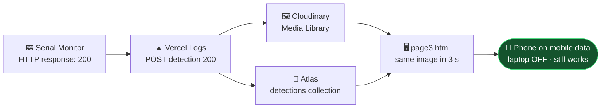
 
| # | Hop | Where to look | ✅ Proof |
|:---:|---|---|---|
| 1 | ESP32 → Vercel | Serial Monitor | `HTTP response: 200`, an `eventId` and `imageUrl` |
| 2 | Vercel | Project → **Logs** | `POST /api/device/detection 200`, no `[cloudinary]` / `[mongodb]` errors |
| 3 | Cloudinary | **Media Library → raksha-rail/detections** | New image whose public ID = the detection's `imagePublicId` |
| 4 | MongoDB | Atlas → **Browse Collections → raksha_rail.detections** | Document whose `_id` = `eventId`, `imageUrl` = Cloudinary URL, `threatStatus: "PENDING"` |
| 5 | Device status | `raksha_rail.devices` | `ESP32-CAM-01`, `status: "ONLINE"`, fresh `lastSeen` |
| 6 | Dashboard | `/page3.html` | Same image + RFID data within ~3 s, new history row, page2 counts increase |
| 7 | Cloud-only | Switch the laptop **off**, open the URL on a phone | Everything is still there 🎉 |
 

## 🔒 Security
 
<p align="center">──────────────<br/>「 sᴇᴄᴜʀɪᴛʏ 」<br/>──────────────</p>
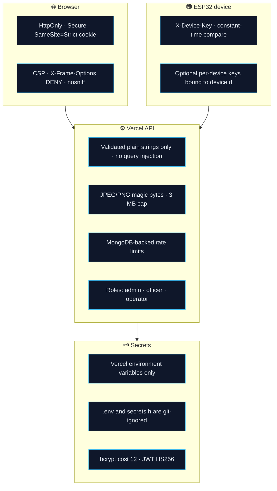
 
| Protection | How |
|---|---|
| 🔑 Passwords | bcrypt cost 12, never stored or logged in plaintext. Response timing doesn't reveal whether an ID exists |
| 🍪 Sessions | Signed JWT in an **HttpOnly, Secure, SameSite=Strict** cookie. JavaScript can't read it |
| 🛂 Access | Every dashboard API requires a session. `PATCH` requires admin/officer or the analysis key |
| 📷 Devices | Separate `X-Device-Key`, compared in constant time, optionally bound per device |
| 🖼️ Images | Real file type checked from bytes, 3 MB cap (below Vercel's 4.5 MB request limit) |
| 🧹 Input | Every value validated to a plain string/number, so MongoDB operator injection is impossible |
| 🚦 Rate limits | Login: 10/ID + 30/IP per 15 min · uploads: 30/min per device · heartbeats: 20/min |
| 🧱 Headers | `vercel.json`: CSP, `X-Frame-Options: DENY`, `nosniff`, `Referrer-Policy`, `Permissions-Policy` |
| 🗝️ Secrets | Only in Vercel env vars. `/api/health` reports only *configured / not configured* |
| 🌍 CORS | None needed: the website and API share one origin, and the ESP32 isn't a browser |
 
### 🔄 If a device key leaks or a board is lost
 
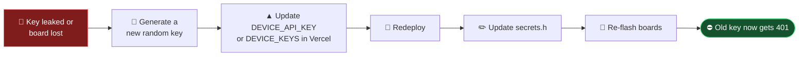
 
> [!TIP]
> Use `DEVICE_KEYS` so each board has **its own key**. A stolen key can't impersonate other devices, and you can replace
> one board's key without re-flashing the rest. Rotating `JWT_SECRET` signs everyone out.
 

## 🛟 Troubleshooting
 
<p align="center">─────────────────────<br/>「 ᴛʀᴏᴜʙʟᴇsʜᴏᴏᴛɪɴɢ 」<br/>─────────────────────</p>
<details>
<summary><b>☁️ Deployment & cloud</b></summary>
| Symptom | Fix |
|---|---|
| `/api/health` shows `not_configured` | Add the missing variable in Vercel → **redeploy** |
| `database: connection_failed` / API `503` | Atlas IP Access List must contain `0.0.0.0/0`; URL-encode special characters in the password |
| Upload returns `502` | Wrong `CLOUDINARY_*` values; check for extra spaces |
| `500 Server is not configured: JWT_SECRET...` | `JWT_SECRET` must be at least 32 characters |
| Slow responses | Vercel function region and Atlas region should match (e.g. both Mumbai) |
 
</details>
<details>
<summary><b>🔐 Login & dashboard</b></summary>
| Symptom | Fix |
|---|---|
| Can't log in on first deploy | `BOOTSTRAP_ADMIN_USERNAME` and `BOOTSTRAP_ADMIN_PASSWORD` (10+ chars) must be set **before** the first login attempt |
| `429 Too many login attempts` | Wait 15 minutes |
| Redirected back to login | Session expired (12 h) or you logged out; log in again |
| page3 shows **RECONNECTING** | Internet connection dropped; it recovers automatically |
| Camera shows **OFFLINE** | No heartbeat/upload for 90 s: check the ESP32's power and Wi-Fi |
 
</details>
<details>
<summary><b>📷 ESP32-CAM</b></summary>
| Symptom | Fix |
|---|---|
| `HTTP response: 401` `Invalid device key` | Key mismatch or stray spaces; redeploy after changing it in Vercel |
| Gets an HTML page / `401` from Vercel | You used a preview URL; use the production domain |
| `HTTP response: -1` | `API_HOST` must not include `https://`; Wi-Fi must be 2.4 GHz; check the power supply |
| `Camera init failed: 0x...` | Reseat the ribbon cable, PSRAM **Enabled**, try `XCLK_FREQ_HZ 10000000` |
| Colors look wrong | `#define SWAP_RGB565_BYTES 1` |
| Image upside down / mirrored | `FLIP_VERTICAL 1` / `MIRROR_HORIZONTAL 1` |
| `Brownout detector was triggered` | Use a 5 V / 2 A supply with short, thick wires |
| `JPEG conversion failed` | PSRAM not enabled, or out of memory |
 
</details>
<details>
<summary><b>🧠 Arduino UNO</b></summary>
| Symptom | Fix |
|---|---|
| ESP32 never receives the trigger | UNO D3 → divider → GPIO13, common GND, both at 9600 baud |
| `PCD_DumpVersionToSerial` shows `0x00` | Reader wiring/SS pin wrong or reader not on 3.3 V |
| Same tag triggers repeatedly | That's expected after 5 s; raise `SAME_TAG_COOLDOWN_MS` |
| Blurry photos | Increase the servo settle delay (`delay(700)`) |
 
</details>

## 🏁 Hackathon status
 
<p align="center">──────────────────────<br/>「 ʜᴀᴄᴋᴀᴛʜᴏɴ sᴛᴀᴛᴜs 」<br/>──────────────────────</p>
| # | Priority | Status |
|:---:|---|---|
| 1 | Public Vercel deployment | ✅ Ready (`vercel.json`, Node 24, 10 functions) |
| 2 | MongoDB connection | ✅ Cached pool, auto indexes |
| 3 | Cloudinary image upload | ✅ Server-side, with rollback on DB failure |
| 4 | Login | ✅ bcrypt + HttpOnly JWT cookie + roles |
| 5 | ESP32 image upload API | ✅ Multipart, device key, validation |
| 6 | Dashboard displays latest image | ✅ Auto-updates every 3 s |
| 7 | RFID data display | ✅ UID, reader, platform, device, time |
| 8 | Detection history | ✅ Paginated, filterable |
| 9 | Device online status | ✅ Heartbeat + 90 s offline rule |
| 10 | Telegram | ✅ Optional, never blocks uploads |
| 11 | AI threat detection | 🟡 Architecture + webhook ready, **model not integrated** |
 
<div align="center">

### 🛡️ Raksha Rail: safer journeys, one scan at a time 🚆
 
**RFID** ▸ **ESP32-CAM** ▸ **Vercel** ▸ **Cloudinary** + **MongoDB Atlas** ▸ **Live Dashboard**
 
</div>
 
