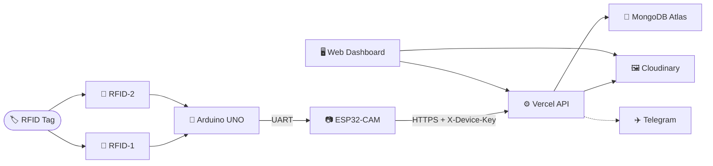

━━━━━━━━━━━━━━━━━━━━━━━━━━━━━━━━━━

<h2 align="center">
    ──「 ʀᴀᴋsʜᴀ ʀᴀɪʟ 」──
</h2>

<p align="center">
  
</p>

<p align="center">
  <b>🛡️ ʀғɪᴅ ᴛʀɪɢɢᴇʀᴇᴅ ʀᴀɪʟᴡᴀʏ sᴀғᴇᴛʏ ᴍᴏɴɪᴛᴏʀɪɴɢ sʏsᴛᴇᴍ</b>
</p>

<p align="center">
  
  
  
  
</p>

<p align="center">
  
  
  
  
</p>

<p align="center">
  🚆 ʀғɪᴅ → ᴀʀᴅᴜɪɴᴏ → ᴇsᴘ32-ᴄᴀᴍ → ᴠᴇʀᴄᴇʟ → ᴄʟᴏᴜᴅɪɴᴀʀʏ + ᴍᴏɴɢᴏᴅʙ → ʟɪᴠᴇ ᴅᴀsʜʙᴏᴀʀᴅ
</p>

━━━━━━━━━━━━━━━━━━━━━━━━━━━━━━━━━━

## 📌 ᴡʜᴀᴛ ɪs ʀᴀᴋsʜᴀ ʀᴀɪʟ?

**Raksha Rail** is a railway safety monitoring system built for a hackathon.

When a tagged bag or item passes an RFID reader on a platform, the system automatically photographs it and displays:

* 🏷️ RFID UID
* 📡 Reader ID
* 🚉 Platform
* 📷 Captured image
* 🕐 Timestamp
* 📊 Detection status
* 📶 Device status

Everything is available through a secure web dashboard within seconds.

> [!IMPORTANT]
> **AI threat detection is NOT integrated yet.**
>
> Every new capture is stored as:
>
> `threatStatus: PENDING`
> `detectionType: UNKNOWN`
> `confidence: null`
>
> The dashboard displays **NOT ANALYZED** until an actual AI model or officer review provides a result.

━━━━━━━━━━━━━━━━━━━━━━━━━━━━━━━━━━

## 📌 ғᴇᴀᴛᴜʀᴇs

<details>
<summary><b>🚀 ᴋᴇʏ ғᴇᴀᴛᴜʀᴇs</b></summary>

<br>

• 🏷️ **ʀғɪᴅ ᴅᴇᴛᴇᴄᴛɪᴏɴ** — Two RFID readers identify tagged items.

• 📷 **ᴀᴜᴛᴏᴍᴀᴛɪᴄ ᴄᴀᴘᴛᴜʀᴇ** — ESP32-CAM captures an image after an RFID event.

• 🎯 **sᴇʀᴠᴏ ᴄᴀᴍᴇʀᴀ ᴘᴏsɪᴛɪᴏɴɪɴɢ** — Arduino UNO rotates the servo toward the detected RFID reader.

• ☁️ **ᴄʟᴏᴜᴅ sᴛᴏʀᴀɢᴇ** — Images are stored permanently through Cloudinary.

• 🍃 **ᴍᴏɴɢᴏᴅʙ ᴀᴛʟᴀs** — Detection, device and user data are stored in MongoDB.

• ⚙️ **ᴠᴇʀᴄᴇʟ sᴇʀᴠᴇʀʟᴇss ᴀᴘɪ** — Public HTTPS API handles device uploads and dashboard requests.

• 🔐 **sᴇᴄᴜʀᴇ ᴀᴜᴛʜᴇɴᴛɪᴄᴀᴛɪᴏɴ** — bcrypt passwords with HttpOnly JWT sessions.

• 🔑 **ᴅᴇᴠɪᴄᴇ ᴀᴘɪ ᴋᴇʏs** — ESP32 requests require an authenticated device key.

• 📊 **ʟɪᴠᴇ ᴅᴀsʜʙᴏᴀʀᴅ** — Dashboard automatically refreshes cloud data.

• 🗂️ **ᴅᴇᴛᴇᴄᴛɪᴏɴ ʜɪsᴛᴏʀʏ** — Paginated and filterable detection history.

• 📡 **ᴅᴇᴠɪᴄᴇ ʜᴇᴀʀᴛʙᴇᴀᴛ** — ESP32 reports online status and Wi-Fi signal.

• ✈️ **ᴛᴇʟᴇɢʀᴀᴍ ᴀʟᴇʀᴛs** — Optional photo + RFID alerts.

• 🤖 **ᴀɪ ᴡᴇʙʜᴏᴏᴋ ʀᴇᴀᴅʏ** — Architecture is prepared for a future AI analysis service.

</details>

━━━━━━━━━━━━━━━━━━━━━━━━━━━━━━━━━━

## 🖼️ sᴄʀᴇᴇɴsʜᴏᴛs

<table>
<tr>
<td width="50%" align="center">

<b>🔐 ᴀᴜᴛʜᴏʀɪᴢᴇᴅ ʟᴏɢɪɴ</b>

<br/>


</td>

<td width="50%" align="center">

<b>📊 ᴄᴏɴᴛʀᴏʟ ᴅᴀsʜʙᴏᴀʀᴅ</b>

<br/>


</td>
</tr>

<tr>
<td width="50%" align="center">

<b>📷 ᴄᴀᴍᴇʀᴀ & ᴛʜʀᴇᴀᴛ ᴍᴏɴɪᴛᴏʀ</b>

<br/>


</td>

<td width="50%" align="center">

<b>📱 ᴍᴏʙɪʟᴇ ᴠɪᴇᴡ</b>

<br/>


</td>
</tr>
</table>

━━━━━━━━━━━━━━━━━━━━━━━━━━━━━━━━━━

## 🧭 ᴀʀᴄʜɪᴛᴇᴄᴛᴜʀᴇ

<p align="center">
  
</p>



### 🧩 ᴛᴇᴄʜ sᴛᴀᴄᴋ

| ʟᴀʏᴇʀ       | ᴛᴇᴄʜɴᴏʟᴏɢʏ                     | ʀᴏʟᴇ                                   |
| ----------- | ------------------------------ | -------------------------------------- |
| 🏷️ sᴇɴsɪɴɢ | RFID + Arduino UNO             | Read RFID UID and control servo        |
| 📷 ᴄᴀᴘᴛᴜʀᴇ  | ESP32-CAM GC2145               | Capture and convert images             |
| ⚙️ ᴀᴘɪ      | Vercel Serverless + Node.js 24 | Authentication, validation and storage |
| 🖼️ ɪᴍᴀɢᴇs  | Cloudinary                     | Permanent image URLs                   |
| 🍃 ᴅᴀᴛᴀ     | MongoDB Atlas                  | Users, devices and detections          |
| 🖥️ ᴜɪ      | HTML + CSS + JavaScript        | Dashboard and monitoring               |
| ✈️ ᴀʟᴇʀᴛs   | Telegram Bot API               | Optional alerts                        |

━━━━━━━━━━━━━━━━━━━━━━━━━━━━━━━━━━

## 🎬 ᴏɴᴇ ʀғɪᴅ sᴄᴀɴ — ғᴜʟʟ ᴊᴏᴜʀɴᴇʏ

```text
🏷️ RFID TAG
     │
     ▼
📡 RFID READER
     │
     ▼
🧠 ARDUINO UNO
     │
     ├── UID
     ├── Reader ID
     └── Servo Position
     │
     ▼
📷 ESP32-CAM
     │
     ├── Capture RGB565
     ├── Convert → JPEG
     └── Build Multipart Request
     │
     ▼
⚙️ VERCEL API
     │
     ├── Verify Device Key
     ├── Validate Data
     ├── Validate Image
     └── Rate Limit
     │
     ├───────────────┐
     ▼               ▼
🖼️ CLOUDINARY    🍃 MONGODB
 Image             Detection
     │               │
     └───────┬───────┘
             ▼
      🖥️ LIVE DASHBOARD
             │
             ▼
       🚨 NEW DETECTION
```

━━━━━━━━━━━━━━━━━━━━━━━━━━━━━━━━━━

## 📁 ᴘʀᴏᴊᴇᴄᴛ sᴛʀᴜᴄᴛᴜʀᴇ

```text
raksha-rail/
│
├── 🌐 public/
│   ├── index.html
│   ├── page2.html
│   ├── page3.html
│   └── js/
│       └── raksha-api.js
│
├── ⚙️ api/
│   ├── health.js
│   ├── auth/
│   │   ├── login.js
│   │   ├── logout.js
│   │   └── me.js
│   │
│   ├── device/
│   │   ├── detection.js
│   │   └── heartbeat.js
│   │
│   ├── detections/
│   │   ├── index.js
│   │   ├── latest.js
│   │   └── [id].js
│   │
│   └── dashboard/
│       └── stats.js
│
├── 🧩 lib/
│   ├── mongodb.js
│   ├── cloudinary.js
│   ├── auth.js
│   ├── validation.js
│   ├── rateLimit.js
│   ├── records.js
│   ├── analysis.js
│   ├── telegram.js
│   └── time.js
│
├── 🛠️ scripts/
│   ├── dev-server.mjs
│   ├── create-user.mjs
│   └── test-upload.mjs
│
├── 🔌 firmware/
│   ├── esp32cam_raksha/
│   └── arduino_uno_rfid/
│
├── 🎨 docs/
│
├── package.json
├── vercel.json
├── .env.example
└── .gitignore
```

━━━━━━━━━━━━━━━━━━━━━━━━━━━━━━━━━━

## 🔌 ʜᴀʀᴅᴡᴀʀᴇ & ғɪʀᴍᴡᴀʀᴇ

### 🧠 ᴀʀᴅᴜɪɴᴏ ᴜɴᴏ

Arduino handles:

* Two MFRC522 RFID readers
* RFID UID extraction
* Duplicate-scan prevention
* Servo positioning
* UART communication with ESP32-CAM

```text
RFID-1 ─┐
        ├──> Arduino UNO ──> Servo
RFID-2 ─┘
                │
                ▼
             UART
                │
                ▼
          ESP32-CAM
```

### 📷 ᴇsᴘ32-ᴄᴀᴍ

The camera module behaves like a **GC2145 / RHYX-M21-45**.

It uses:

```text
RGB565
   ↓
QVGA 320×240
   ↓
Software JPEG conversion
   ↓
Multipart HTTPS upload
   ↓
Vercel API
```

> [!WARNING]
> This camera is **not an OV2640** and does not provide hardware JPEG. The firmware therefore captures RGB565 and converts it using `frame2jpg()`.

### ⚙️ ғɪʀᴍᴡᴀʀᴇ ᴏᴘᴛɪᴏɴs

| `#define`               |    Default | Purpose                      |
| ----------------------- | ---------: | ---------------------------- |
| `TEST_MODE`             |        `1` | Test uploads without Arduino |
| `JPEG_QUALITY`          |       `80` | JPEG quality                 |
| `SWAP_RGB565_BYTES`     |        `0` | Fix incorrect colors         |
| `FLIP_VERTICAL`         |        `0` | Flip image vertically        |
| `MIRROR_HORIZONTAL`     |        `0` | Mirror image                 |
| `XCLK_FREQ_HZ`          | `20000000` | Camera clock                 |
| `USE_FLASH_LED`         |        `0` | Enable camera flash          |
| `HEARTBEAT_INTERVAL_MS` |    `30000` | Device heartbeat             |
| `UPLOAD_ATTEMPTS`       |        `3` | Upload retries               |

━━━━━━━━━━━━━━━━━━━━━━━━━━━━━━━━━━

## ⚙️ ʙᴀᴄᴋᴇɴᴅ ᴀᴘɪ

| ᴍᴇᴛʜᴏᴅ  | ᴇɴᴅᴘᴏɪɴᴛ                 | ᴀᴜᴛʜ             |
| ------- | ------------------------ | ---------------- |
| `POST`  | `/api/device/detection`  | 🔑 Device key    |
| `POST`  | `/api/device/heartbeat`  | 🔑 Device key    |
| `POST`  | `/api/auth/login`        | 🌍 Public        |
| `POST`  | `/api/auth/logout`       | 🌍 Public        |
| `GET`   | `/api/auth/me`           | 👮 Session       |
| `GET`   | `/api/detections/latest` | 👮 Session       |
| `GET`   | `/api/detections`        | 👮 Session       |
| `GET`   | `/api/detections/:id`    | 👮 Session       |
| `PATCH` | `/api/detections/:id`    | 👮 Officer/Admin |
| `GET`   | `/api/dashboard/stats`   | 👮 Session       |
| `GET`   | `/api/health`            | 🌍 Public        |

### 📡 ᴇsᴘ32 ᴜᴘʟᴏᴀᴅ

```http
POST /api/device/detection
X-Device-Key: <DEVICE_API_KEY>
Content-Type: multipart/form-data
```

Required fields:

```text
image
rfidUid
readerId
deviceId
platform
```

Optional:

```text
timestamp
wifiSignal
```

━━━━━━━━━━━━━━━━━━━━━━━━━━━━━━━━━━

## 🔐 ᴀᴜᴛʜᴇɴᴛɪᴄᴀᴛɪᴏɴ & sᴇssɪᴏɴs

Raksha Rail uses:

* 🔒 bcrypt password hashing
* 🍪 HttpOnly JWT cookie
* 🛡️ Secure cookie
* 🔐 SameSite=Strict
* 🚦 Login rate limiting
* 👥 Role-based access

### 👤 ʀᴏʟᴇs

| Role       | Dashboard | Review |
| ---------- | :-------: | :----: |
| `admin`    |     ✅     |    ✅   |
| `officer`  |     ✅     |    ✅   |
| `operator` |     ✅     |    ❌   |

### ⏱️ sᴇssɪᴏɴ

Default session:

```text
12 hours
```

With **Remember me**:

```text
7 days
```

━━━━━━━━━━━━━━━━━━━━━━━━━━━━━━━━━━

## 📺 ʟɪᴠᴇ ᴅᴀsʜʙᴏᴀʀᴅ

The dashboard uses lightweight polling instead of WebSockets.

```text
Every 3 seconds
       ↓
GET /api/detections/latest
       ↓
eventId changed?
       │
   ┌───┴───┐
   │       │
  NO      YES
   │       │
   │       ├── Update image
   │       ├── Update RFID
   │       ├── Update history
   │       ├── Update status
   │       └── Show notification
   │
   └───────> Continue polling
```

* `page3.html` → latest detection every **3 s**
* `page3.html` → dashboard stats every **10 s**
* `page2.html` → dashboard stats every **5 s**
* Polling pauses when the browser tab is hidden
* Page 3 includes a pause button

━━━━━━━━━━━━━━━━━━━━━━━━━━━━━━━━━━

## 🗃️ ᴅᴀᴛᴀ ᴍᴏᴅᴇʟ

### 👤 ᴜsᴇʀs

```text
_id
username
email
passwordHash
role
isActive
createdAt
lastLoginAt
```

### 📷 ᴅᴇᴠɪᴄᴇs

```text
_id
deviceId
deviceName
deviceType
status
ipAddress
wifiSignal
lastSeen
createdAt
```

### 🚨 ᴅᴇᴛᴇᴄᴛɪᴏɴs

```text
_id
rfidUid
readerId
platform
deviceId
imageUrl
imagePublicId
threatStatus
detectionType
confidence
analysis
timestamp
timestampSource
createdAt
```

> [!NOTE]
> Images are **never stored directly in MongoDB**. MongoDB stores the Cloudinary URL and public ID while the image bytes remain in Cloudinary.

━━━━━━━━━━━━━━━━━━━━━━━━━━━━━━━━━━

## 🤖 ᴛʜʀᴇᴀᴛ ᴀɴᴀʟʏsɪs & ғᴜᴛᴜʀᴇ ᴀɪ

Current system:

```text
📷 Image uploaded
       ↓
🟠 PENDING
       ↓
NOT ANALYZED
```

Possible future states:

```text
🟢 CLEAR
🟠 SUSPICIOUS
🔴 THREAT
```

Detection types:

```text
UNKNOWN
NONE
NARCOTICS
EXPLOSIVE
WEAPON
OTHER
```

### 🔌 ғᴜᴛᴜʀᴇ ᴀɪ ᴡᴏʀᴋғʟᴏᴡ

```text
Vercel API
    │
    ▼
MongoDB
    │
    ├── PENDING detection
    │
    ▼
AI Webhook
    │
    ▼
AI Model
    │
    ▼
PATCH /api/detections/:id
    │
    ▼
MongoDB
    │
    ▼
Live Dashboard
```

> [!IMPORTANT]
> An uploaded image alone does **not** prove the presence of a threat. AI analysis must be separately integrated and verified.

━━━━━━━━━━━━━━━━━━━━━━━━━━━━━━━━━━

## 🔧 ᴇɴᴠɪʀᴏɴᴍᴇɴᴛ ᴠᴀʀɪᴀʙʟᴇs

Configure these inside:

**Vercel → Project → Settings → Environment Variables**

| Variable                       | Required | Purpose                  |
| ------------------------------ | :------: | ------------------------ |
| `MONGODB_URI`                  |     ✅    | MongoDB Atlas connection |
| `MONGODB_DB`                   |     –    | Database name            |
| `CLOUDINARY_CLOUD_NAME`        |     ✅    | Cloudinary cloud         |
| `CLOUDINARY_API_KEY`           |     ✅    | Cloudinary API key       |
| `CLOUDINARY_API_SECRET`        |     ✅    | Server-side secret       |
| `CLOUDINARY_FOLDER`            |     –    | Image folder             |
| `JWT_SECRET`                   |     ✅    | JWT signing secret       |
| `SESSION_HOURS`                |     –    | Session duration         |
| `DEVICE_API_KEY`               |     ✅    | ESP32 authentication     |
| `DEVICE_KEYS`                  |     –    | Per-device keys          |
| `DEVICE_OFFLINE_AFTER_SECONDS` |     –    | Offline threshold        |
| `BOOTSTRAP_ADMIN_USERNAME`     |     ✅    | First admin              |
| `BOOTSTRAP_ADMIN_PASSWORD`     |     ✅    | First admin password     |
| `BOOTSTRAP_ADMIN_EMAIL`        |     –    | Admin email              |
| `APP_TIMEZONE`                 |     –    | Application timezone     |
| `TELEGRAM_BOT_TOKEN`           |     –    | Optional Telegram        |
| `TELEGRAM_CHAT_ID`             |     –    | Optional Telegram        |
| `ANALYSIS_WEBHOOK_URL`         |     –    | Future AI webhook        |
| `ANALYSIS_API_KEY`             |     –    | Future AI authentication |

### 🔑 ɢᴇɴᴇʀᴀᴛᴇ sᴇᴄʀᴇᴛs

```bash
node -e "console.log(require('crypto').randomBytes(32).toString('hex'))"
```

━━━━━━━━━━━━━━━━━━━━━━━━━━━━━━━━━━

## ⚡ ǫᴜɪᴄᴋ sᴛᴀʀᴛ

### 📦 ʀᴇǫᴜɪʀᴇᴍᴇɴᴛs

* Node.js 24
* Git
* MongoDB Atlas — cloud mode
* Cloudinary — cloud mode

### 🚀 ɪɴsᴛᴀʟʟ

```bash
git clone https://github.com/<you>/raksha-rail.git

cd raksha-rail

npm install

npm run dev
```

Open:

```text
http://localhost:3000
```

### 🧪 ᴅᴇᴍᴏ ᴍᴏᴅᴇ

Without `.env`:

```text
Username: admin
Password: Admin-Demo-123
```

Device key:

```text
local-demo-device-key
```

### 📸 ᴛᴇsᴛ ᴜᴘʟᴏᴀᴅ

```bash
npm run test-upload -- \
  --url http://localhost:3000 \
  --key local-demo-device-key \
  --rfid 04:A3:2B:1C \
  --reader RFID-2
```

━━━━━━━━━━━━━━━━━━━━━━━━━━━━━━━━━━

## ☁️ ᴅᴇᴘʟᴏʏᴍᴇɴᴛ

```text
                 ┌─────────────────┐
                 │     GitHub      │
                 └────────┬────────┘
                          │
                          ▼
                 ┌─────────────────┐
                 │ MongoDB Atlas   │
                 └────────┬────────┘
                          │
                          ▼
                 ┌─────────────────┐
                 │   Cloudinary    │
                 └────────┬────────┘
                          │
                          ▼
                 ┌─────────────────┐
                 │     Vercel      │
                 └────────┬────────┘
                          │
                          ▼
                 ┌─────────────────┐
                 │  ESP32-CAM      │
                 └────────┬────────┘
                          │
                          ▼
                  🛡️ RAKSHA RAIL
```

### 🍃 ᴍᴏɴɢᴏᴅʙ ᴀᴛʟᴀs

Create a free M0 cluster and configure:

```text
MONGODB_URI
MONGODB_DB
```

### 🖼️ ᴄʟᴏᴜᴅɪɴᴀʀʏ

Configure:

```text
CLOUDINARY_CLOUD_NAME
CLOUDINARY_API_KEY
CLOUDINARY_API_SECRET
```

### ▲ ᴠᴇʀᴄᴇʟ

Import the GitHub repository and configure the environment variables.

After deployment:

```text
/api/health
```

should return a healthy deployment response.

> [!WARNING]
> The ESP32 should use the **production Vercel domain**, not a preview deployment URL.

━━━━━━━━━━━━━━━━━━━━━━━━━━━━━━━━━━

## 🧪 ᴛᴇsᴛɪɴɢ

### 1️⃣ ʟᴏᴄᴀʟ ᴅᴇᴍᴏ

```bash
npm run dev
```

### 2️⃣ ᴛᴇsᴛ ᴜᴘʟᴏᴀᴅ

```bash
npm run test-upload
```

### 3️⃣ ᴛᴇsᴛ ʜᴇᴀʟᴛʜ

```text
GET /api/health
```

### 4️⃣ ᴛᴇsᴛ ᴅᴀsʜʙᴏᴀʀᴅ

Verify:

```text
✓ Login
✓ Detection
✓ Image
✓ RFID UID
✓ Reader
✓ Platform
✓ Timestamp
✓ Device status
✓ History
✓ Live polling
```

━━━━━━━━━━━━━━━━━━━━━━━━━━━━━━━━━━

## 🛡️ sᴇᴄᴜʀɪᴛʏ

Raksha Rail includes:

```text
🔐 bcrypt password hashing
🍪 HttpOnly JWT sessions
🛡️ Secure + SameSite cookies
🔑 Device API keys
🚦 Rate limiting
📦 Input validation
🖼️ Image magic-byte validation
🌐 Content Security Policy
☁️ Server-side Cloudinary secrets
```

### 🔒 ᴅᴇᴠɪᴄᴇ sᴇᴄᴜʀɪᴛʏ

ESP32 requests contain:

```http
X-Device-Key: <DEVICE_API_KEY>
```

The API verifies:

```text
Device Key
     ↓
Device ID
     ↓
Allowed binding
     ↓
Request accepted
```

━━━━━━━━━━━━━━━━━━━━━━━━━━━━━━━━━━

## 🛠️ ᴛʀᴏᴜʙʟᴇsʜᴏᴏᴛɪɴɢ

### ❌ ᴇsᴘ32 ɴᴏᴛ ᴜᴘʟᴏᴀᴅɪɴɢ

Check:

```text
✓ Wi-Fi is 2.4 GHz
✓ API_HOST is correct
✓ DEVICE_API_KEY matches Vercel
✓ Production domain is being used
✓ Camera initializes correctly
✓ PSRAM is enabled
```

### ❌ ᴄᴏʟᴏʀs ʟᴏᴏᴋ ᴡʀᴏɴɢ

Try:

```cpp
#define SWAP_RGB565_BYTES 1
```

### ❌ ɪᴍᴀɢᴇ ᴜᴘsɪᴅᴇ ᴅᴏᴡɴ

Try:

```cpp
#define FLIP_VERTICAL 1
```

### ❌ ᴄʟᴏᴜᴅɪɴᴀʀʏ ᴇʀʀᴏʀ

Verify:

```text
CLOUDINARY_CLOUD_NAME
CLOUDINARY_API_KEY
CLOUDINARY_API_SECRET
```

### ❌ ᴍᴏɴɢᴏᴅʙ ᴇʀʀᴏʀ

Verify:

```text
MONGODB_URI
Atlas Network Access
Database User
Database Password
```

━━━━━━━━━━━━━━━━━━━━━━━━━━━━━━━━━━

## 🚦 ʜᴀᴄᴋᴀᴛʜᴏɴ sᴛᴀᴛᴜs

### ✅ ᴄᴏᴍᴘʟᴇᴛᴇᴅ

```text
✓ RFID detection
✓ Arduino control
✓ Servo positioning
✓ ESP32-CAM capture
✓ RGB565 → JPEG
✓ HTTPS upload
✓ Vercel API
✓ Cloudinary storage
✓ MongoDB persistence
✓ Authentication
✓ Device authentication
✓ Live dashboard
✓ Detection history
✓ Device heartbeat
✓ Telegram integration hook
✓ Future AI webhook architecture
```

### 🔮 ғᴜᴛᴜʀᴇ

```text
→ Real AI threat analysis
→ Advanced anomaly detection
→ Better camera hardware
→ Multi-platform deployment
→ Advanced officer controls
→ More real-time alerting
```

━━━━━━━━━━━━━━━━━━━━━━━━━━━━━━━━━━

## 📡 ᴇsᴘ32 ᴘʀᴏᴛᴏᴄᴏʟ

Arduino → ESP32:

```text
RFID,A1:B2:C3:D4,RFID-1
```

ESP32 → API:

```text
POST /api/device/detection
```

API → ESP32:

```json
{
  "success": true,
  "eventId": "...",
  "imageUrl": "...",
  "threatStatus": "PENDING",
  "detectionType": "UNKNOWN"
}
```

━━━━━━━━━━━━━━━━━━━━━━━━━━━━━━━━━━

## 📊 ʟɪᴠᴇ ᴅᴀᴛᴀ ғʟᴏᴡ

```text
🏷️ RFID
   ↓
🧠 Arduino
   ↓
📷 ESP32-CAM
   ↓
⚙️ Vercel
   ↓
┌───────────────┐
│               │
▼               ▼
☁️ Cloudinary  🍃 MongoDB
│               │
└───────┬───────┘
        ↓
   🖥️ Dashboard
        ↓
   🚨 Detection
```

━━━━━━━━━━━━━━━━━━━━━━━━━━━━━━━━━━

## 📝 ɴᴏᴛᴇ

> ᴛʜɪs ᴘʀᴏᴊᴇᴄᴛ ᴡᴀs ʙᴜɪʟᴛ ғᴏʀ ᴀ ʜᴀᴄᴋᴀᴛʜᴏɴ ᴀɴᴅ ɪs ᴅᴇsɪɢɴᴇᴅ ᴀs ᴀ ʀᴇᴀʟ-ᴡᴏʀʟᴅ ʀᴀɪʟᴡᴀʏ sᴀғᴇᴛʏ ᴍᴏɴɪᴛᴏʀɪɴɢ ᴘʀᴏᴛᴏᴛʏᴘᴇ.

### 🛡️ ʀᴀᴋsʜᴀ ʀᴀɪʟ

**RFID → Camera → Cloud → Dashboard**

**ᴅᴇᴛᴇᴄᴛ. ᴄᴀᴘᴛᴜʀᴇ. ᴍᴏɴɪᴛᴏʀ.**

━━━━━━━━━━━━━━━━━━━━━━━━━━━━━━━━━━

<p align="center">
  <b>「 🛡️ ʀᴀᴋsʜᴀ ʀᴀɪʟ • ʀᴀɪʟᴡᴀʏ sᴀғᴇᴛʏ ᴍᴏɴɪᴛᴏʀɪɴɢ 」</b>
</p>

<p align="center">
  
</p>
